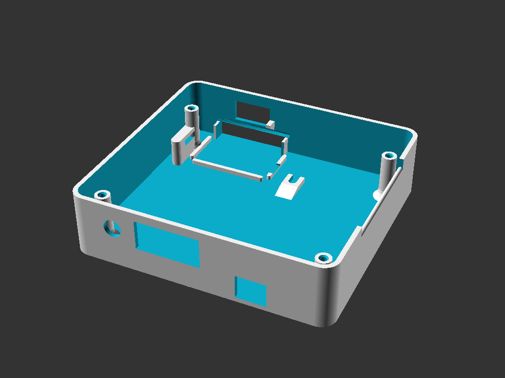
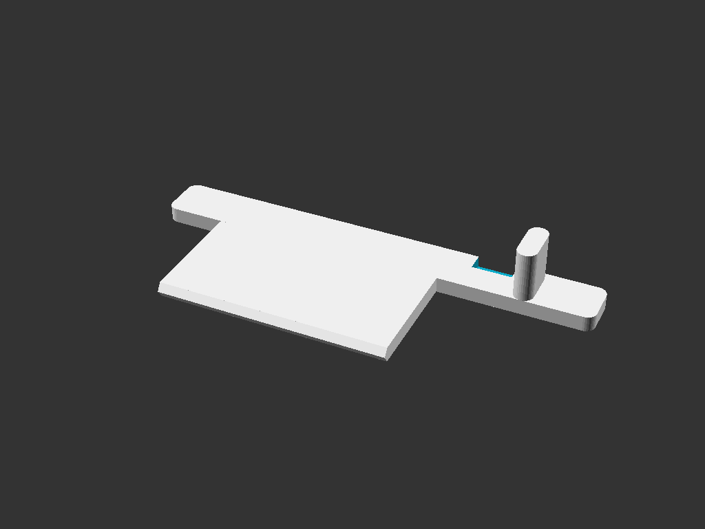

## Enclosure for Peter Bartlett's MISE and M3SE.
http://bartlettlabs.com/MISE/index.html  
http://bartlettlabs.com/M3SE/index.html

The source design file is written in OpenSCAD  
https://www.openscad.org/

There are also FreeCAD files in the FreeCAD directory. These are the original design, but the files are difficult to edit without breaking the model.  
http://www.freecadweb.org/

The *.stl files are for 3d-printing.

Pictures: https://goo.gl/photos/jDpvjbgjePCddrG99  
(scroll to the bottom for the most recent)

### Directions:

#### 1 - 3D print the *.stl files
 top_cover.stl  
 bottom_cover.stl  
 retainer.stl  

#### 2 - Aquire the following parts

* **1 40-pin "IDE" male-female extension cable, 4 inch length**  
 It needs to be an extension, with one male and one female connector.  
 The direction the cable exits the connector on the *male* end matters. The cable should go *away* from the key notch in the side of the connector.  
 No extra fold / strain relief clip on the male connector.  
 No special requirements for the female connector.  
 
 http://www.cablesonline.com/240pinidedir.html  
 Change “Available Lengths: 4 inches FI-004”

* **4 flat-head #8 x 3/4" sheet metal or wood screws**  
 I prefer stainless steel as well but that's just a preference.  
 Self-tapping would be better (less likely to break the screw posts the first time the screws are run in) but those are not common at your local hardware store, and standard sheet metal screws like the examples below are fine.  

 On-Line:  
 https://www.boltdepot.com/Product-Details.aspx?product=2214  

 Home Depot:  
 http://www.homedepot.com/p/Crown-Bolt-8-x-3-4-in-Phillips-Flat-Head-Sheet-Metal-Screws-5-per-Pack-35271/202706578  

 Lowes:  
 http://www.lowes.com/pd_150742-37672-126965_1z0vrdvZ1z0yjldZ1z0yjpkZ1z0zbdkZ1z1291f__?productId=3817895&pl=1

* **4 small rubber feet**  
 http://www.homedepot.com/p/Everbilt-1-2-in-Self-Adhesive-Vinyl-Surface-Bumpers-16-per-Pack-49967/203661150

#### 3 - Assembly
Unplug the cf reader from the MISE.  
Remove the 4 nylon stand-offs from the screw holes on the MISE.  
Plug the female end of the 40 pin extension cable into the MISE where the cf reader used to be.

Lay the cf reader flat in the small tray formed into the corner of the top_cover, with the lights and jumpers up facing you. The white CF slot rails on the back side of the cf reader fits exactly into that tray.

Looking down into the top_cover with the cf reader in the top-right corner, insert the offset foot end of the retainer clip into the slot to the right of the cf reader.  
Swing the retainer clip down over the cf reader, and back towards you, enough to slide the left side of the retainer into the slot to the left of the cf reader, attached to the screw post.  
Push the retainer clip forward until it snaps firmly in place.

Turn the top_cover around so the cf reader is to your right and close to you, and the round hole on the rear wall is away from you.  
Hold the MISE upside down with the network jack away from you.  
Angle the network jack down into the rear wall away from you. Rest the rear side of the MISE on the two rear screw posts, keep the front side of the MISE lifted up.  
Connect the male end of the 40 pin extension cable onto the cf reader.  
Lay the front edge of the MISE down, pay attention that the network jack pokes into the square hole in the rear wall as you swing the front edge down.

Press the 4 rubber feet onto the flat side of the base_plate, just inside of the screw holes (right next to each screw hole, towards the center of the plate rather than towards the outside edge).  
Place the base_plate on top of the MISE, with the short risers down, touching the MISE (ie with the new feet up).  
Make sure the screw holes line up. The screws are closer to the rear wall and further away from the front wall.  
The base_plate should now be flush with the edge of the top_cover. 

Install the 4 screws. Don't over-tighten. 3d-printing is not super strong.

DONE!

---

## Notes on 3d printing

#### Where/how to get a print?
I used http://www.3dhubs.com to find a small local individual 3D print service.  
This is both cheaper and more convenient than some of the larger internet 3d print services.  
In my case the printer I found turned out to be a local R/C drone hobby shop, but it could be anything from a guy with a printer in his garage to a dedicated manufacturing shop.

But there are numerous 3D print services on-line. The most famous is probably http://www.shapeways.com

#### Special warning
The top_cover is very difficult to print in ABS using FDM. Because of the size and shape of the part, it tends to curl up from the bed.  
I personally recommend printing in ABS anyway, for the strength and longevity of the material. It is possible. It just requires a good printer with a heated bed and full enclosure, and it requires the printer operator to be fairly good.  
I think the main tricks being used by the guy who has successfully printed several copies (prototypes) for me are,  
- the part is elevated off the print bed and printed on rafting,  
- and the in-fill seems to be about 50% density.

Also not all colors of ABS have the same mechanical properties it seems. I have a few prints in black ABS which are fine, but when I got a print in grey ABS, it was more brittle, the layers split apart in a couple of the screw posts, and part of the exterior wall layer separated. Those were all repairable with acetone.

Another option is to print in PLA instead. PLA will print a lot easier, but PLA is a biodegradable material which might not be very nice for the neice or nephew or grandkids who gets your collection of vintage stuff in 30 years. It's also more brittle. But even so, it's probably realistically a fine option.

Another option is to print by some other method than FDM. For instance, http://www.shapeways.com prints by laser sintering, not FDM, and their cheapest material is nylon, not ABS. I have not ordered a print of this from Shapeways (because it's $90 just for the top_cover part alone) but I believe it would come out perfect. But then again, nylon is awful material to try to sand and paint, or glue.

If you do print in ABS, and anything breaks, at least it is very easy to repair with acetone.

When printing the top_cover using FDM printing, you definitely want to print the part with the top down, the way it appears in the freecad and stl files. Otherwise the rafting is impossible to clean out of the inside and especially it wrecks all the small exact shapes that make up the cf card reader holder in the top_cover.

I suggest getting a "pick and probe" set to clean out the rafting from around the small features of the cf card reader holder.

Example: http://www.homedepot.com/p/Husky-Precision-Pick-and-Probe-Set-4-Piece-60004H/204314893

It's the only way to cleanly dig out the little slots for the cf retainer. You want to poke the probe points right up into all 4 corners of those slots and scrape all 5 interior surfaces to get a good clean rectangular shape inside, so the matching tab fits in.

Also pay attention to the underside of the little tabs that stick out of the front wall, between the joystick port and the cf card port. Some rafting will likely be stuck under there and it will interfere with the cf retainer which needs to snap into that spot. Scrape all along that edge actually, not just the two tabs that stick out. There is a slight overhang all along the joystick port, and you can't directly see if anything is in there to interfere with the cf retainer.

---

## Working with the source FCStd files

FreeCAD: http://www.freecadweb.org/

Both the MISE and M3SE stl files for the top_cover are exported from the same MISE_top_cover.FCStd file.  
  
The file is basically for the MISE, with the M3SE changes added as the last 2 Sketches and Pockets at the very end, where it is simple and safe to delete them to switch from M3SE to MISE. As-shipped, the file is really for M3SE, and to get a MISE, you have to delete the last 4 steps from the bottom of the tree. This is necessitated by the way FreeCAD (and most 3d solid modelling cad software) works, where you can't just add or remove features anywhere in the file. About the only thing you can do easily without breaking the drawing, is to delete the very last step, and the next-last, etc working backwards.  
  
To get a M3SE:  
- Open MISE_top_cover.FCStd  
- Double-click anywhere on the part in the drawing until the entire part turns green
- File->Export->foo_m3se.stl  
  
To get a MISE:
- Open MISE_top_cover.FCStd  
- Delete the last Pocket
- Delete the last Sketch
- Delete the last Pocket
- Delete the last Sketch
- Double-click anywhere on the part in the drawing until the entire part turns green.
- File->Export->foo_mise.stl

## Author / License

These files are licenced under the GPL.  
http://www.gnu.org/licenses/gpl-3.0.en.html  
Brian K. White - bw.aljex@gmail.com - 20160423
